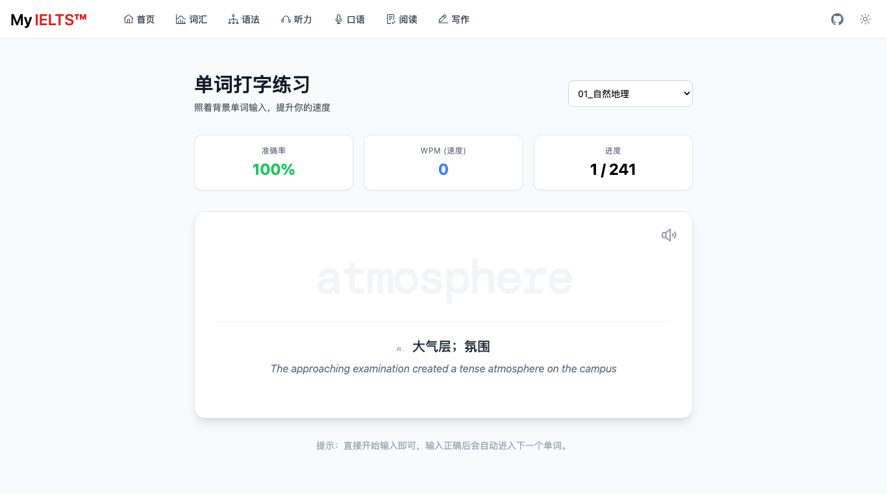
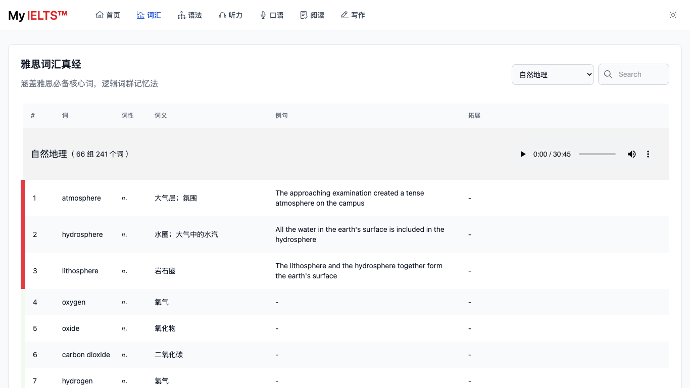
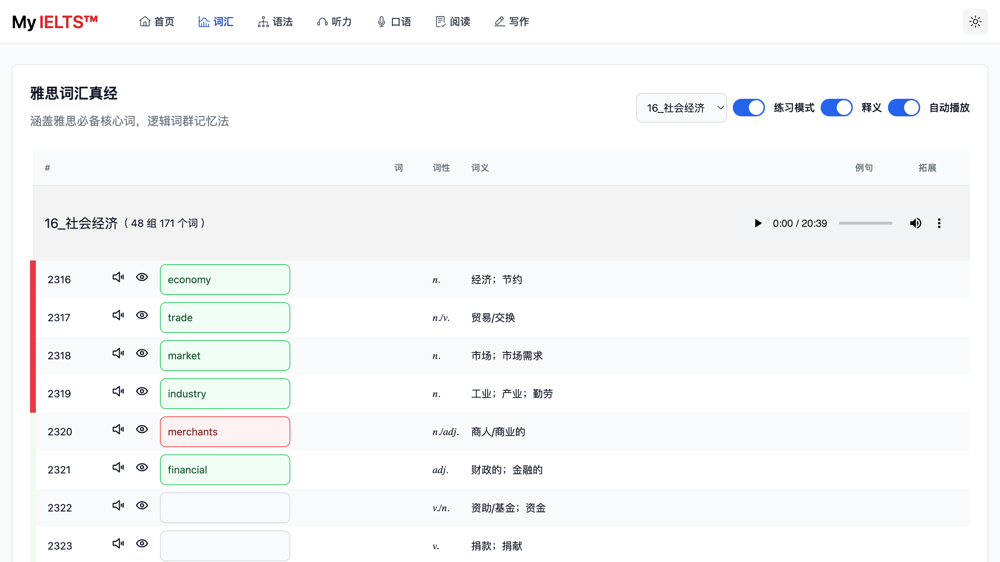
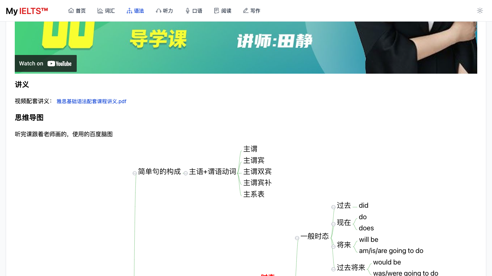
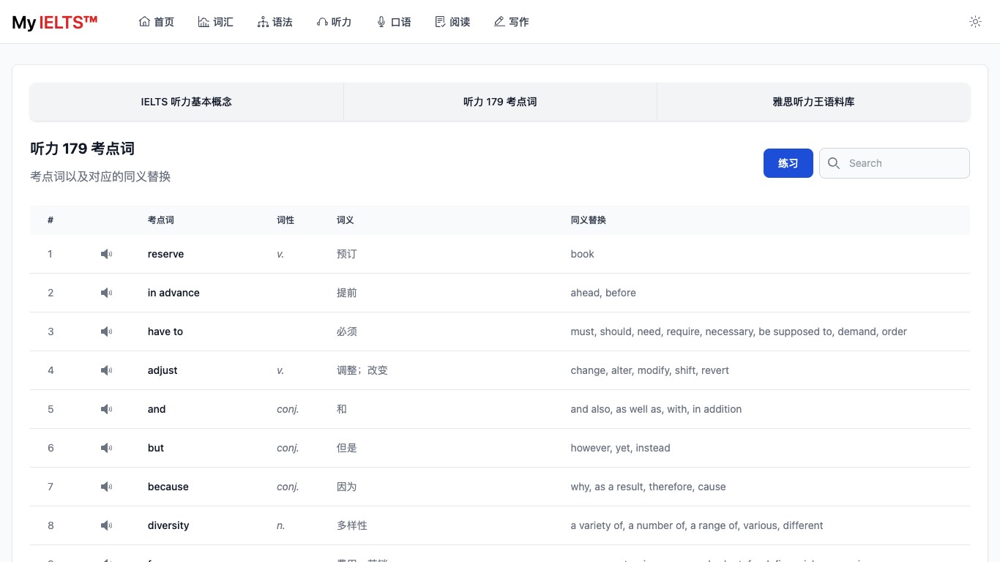
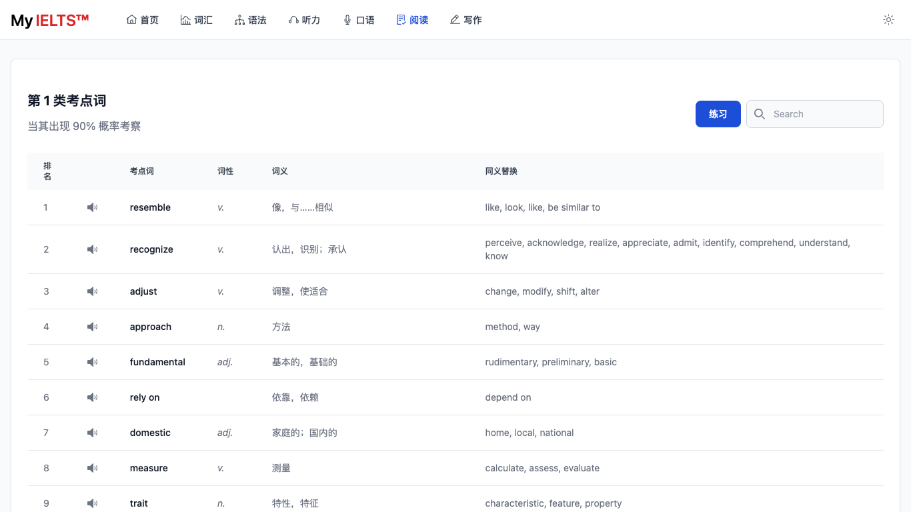
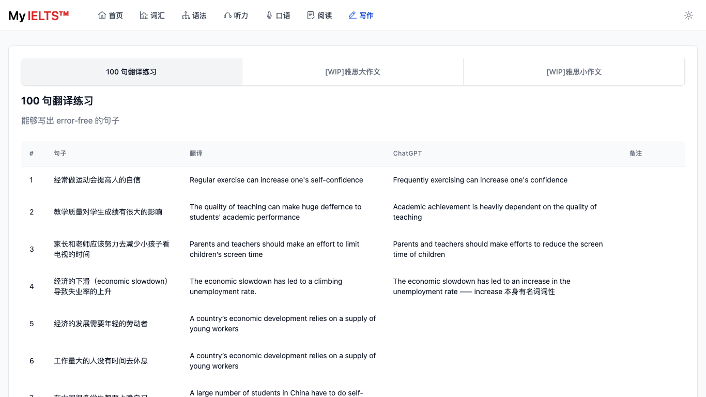

<p><br></p>

<picture>
  <source media="(prefers-color-scheme: dark)" srcset="public/salvation_lies_within_IELTS_dark.svg">
  <source media="(prefers-color-scheme: light)" srcset="public/salvation_lies_within_IELTS_light.svg">
  
</picture>

<p><br></p>
<p><br></p>
<h1 align='center'>
  My <span>CET-6</span>
</h1>

<h2 align='center'>在线地址</h2>
<p align='center'>
  <a href="https://hefengxian.github.io/my-CET-6/">https://hefengxian.github.io/my-CET-6/</a>
</p>

## 概述

英语六级（CET-6）备考资料，包含词汇、语法、听说读写等内容。

- [x] 词汇练习模式（含打字练习）

## 功能展示

### 词汇

> 2026-03 增加打字练习模式，感谢 [@Tommy1109255](https://github.com/Tommy1109255)

<picture>
  <source media="(prefers-color-scheme: dark)" srcset="public/screenshot/typing-vocabulary-dark.png">
  <source media="(prefers-color-scheme: light)" srcset="public/screenshot/typing-vocabulary-light.png">
  
</picture>

词列表

<picture>
  <source media="(prefers-color-scheme: dark)" srcset="public/screenshot/screenshot-vocabulary-dark.png">
  <source media="(prefers-color-scheme: light)" srcset="public/screenshot/screenshot-vocabulary-light.png">
  
</picture>

练习模式

<picture>
  <source media="(prefers-color-scheme: dark)" srcset="public/screenshot/screenshot-vocabulary-training-mode-dark.png">
  <source media="(prefers-color-scheme: light)" srcset="public/screenshot/screenshot-vocabulary-training-mode-light.png">
  
</picture>

### 语法

新东方英语语法（含视频、讲义、思维导图）

<picture>
  <source media="(prefers-color-scheme: dark)" srcset="public/screenshot/screenshot-grammar-dark.png">
  <source media="(prefers-color-scheme: light)" srcset="public/screenshot/screenshot-grammar-light.png">
  
</picture>

### 听力

- 基本概念和应试技巧
- 听力考点词

<picture>
  <source media="(prefers-color-scheme: dark)" srcset="public/screenshot/screenshot-listening-dark.png">
  <source media="(prefers-color-scheme: light)" srcset="public/screenshot/screenshot-listening-light.png">
  
</picture>

### 阅读

- 考点词同义替换

<picture>
  <source media="(prefers-color-scheme: dark)" srcset="public/screenshot/screenshot-reading-dark.png">
  <source media="(prefers-color-scheme: light)" srcset="public/screenshot/screenshot-reading-light.png">
  
</picture>

### 写作

- 100 句翻译练习

<picture>
  <source media="(prefers-color-scheme: dark)" srcset="public/screenshot/screenshot-writing-dark.png">
  <source media="(prefers-color-scheme: light)" srcset="public/screenshot/screenshot-writing-light.png">
  
</picture>

## 开发

本项目使用 [Vitesse Lite](https://github.com/antfu/vitesse-lite) 作为模板开发。

```bash
# 安装依赖
npm install

# 开发模式
npm run dev

# 构建
npm run build

# 预览
npm run preview
```

## 部署

### GitHub Pages

项目已配置 GitHub Actions 自动部署。推送代码到 `main` 分支后，会自动构建并部署到 `gh-pages` 分支。

在仓库 Settings → Pages 中将 Source 设置为 `Deploy from a branch`，分支选择 `gh-pages`，目录选择 `/ (root)`。

### 本地部署

```bash
npm run build
```

将 `dist/` 目录部署到任意静态服务器即可。

## License

禁止将本项目用于任何商业目的！
